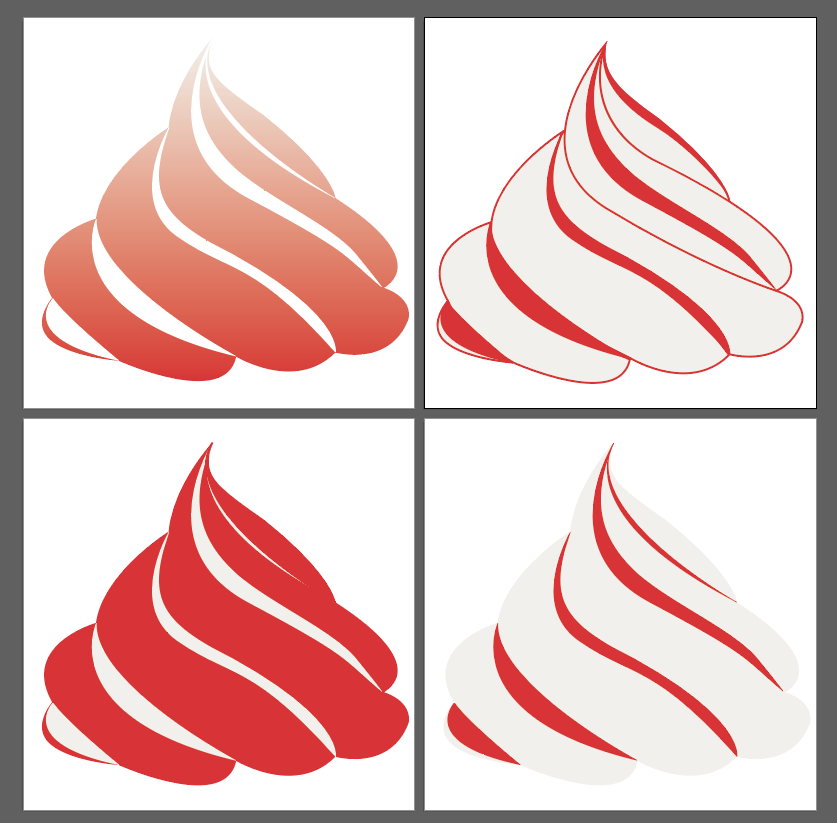
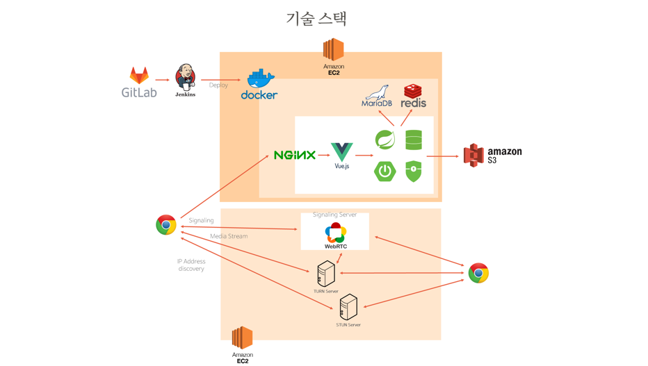

# Welcome to CREAMING



> 크리밍 (Creaming) 웹사이트 

## 🏠 [Homepage](https://www.creaming.co.kr)

<br>

## :construction_worker: 팀원소개


**:panda_face: Min Seok Cha**

- Github: [@meloncha](https://github.com/meloncha)

**:hamster: Byeong Hun Lee**

- Github: [@kr2020lbh](https://github.com/kr2020lbh)

**:hatched_chick: Jin Ok Seong**

- Github: [@wlsdhr0831](https://github.com/wlsdhr0831)

**:koala: Seong Ho Park**

- Github: [@solser12](https://github.com/solser12)

**:turtle: Da Yun Kim**

- Github: [@daaaaaayoon](https://github.com/daaaaaayoon)

<br>

## 📆 프로젝트 개요

- **진행 기간**: 2021.04.12 ~ 2021.05.21
- **목표**
	- 요리를 집에서 재미있게 하고 싶은 사람
	- 요리를 집에서 맛있게 하고 싶은 사람
	- 요리를 집에서 편리하게 하고 싶은 사람
  - :star: 이 모든 사람들을 위한 온라인 쿠킹 클래스 스트리밍 서비스
- **웹사이트 이름**: Creaming 
  - Cook + Streaming / Creator + Streaming
  - 온라인 쿠킹 클래스 스트리밍 서비스
- **슬로건**: **"** 누구나 요리선생님이 된다. 온라인 쿠킹 클래스 스트리밍 서비스, 크리밍 **"**

<br>

## 📒 Tech Log

<details>
    <summary>1주차</summary>
    <ul>
        <a href="documents/dev_log/20210412_dev_log.md"><li>4/12 - 기획 (방향성 정하기 & 아이디어 회의 및 주제 선정)</li></a>
        <a href="documents/dev_log/20210413_dev_log.md"><li>4/13 - 기획 (주요 기능 상세히 작성하기, 프론트/백 기술 스펙 정하기)</li></a>
        <a href="documents/dev_log/20210414_dev_log.md"><li>4/14 - 기획 (서비스 한 줄 소개 정하기, 프로젝트 계획서 제출, SSAFY 일정 참가)</li></a>
        <a href="documents/dev_log/20210415_dev_log.md"><li>4/15 - 기획 (Design Template 참고, 와이어프레임 작성 관련 discussion) </li></a>
        <a href="documents/dev_log/20210416_dev_log.md"><li>4/16 - BackEnd : DB ERD & Entity 설계, Streaming OpenSource 비교, FrontEnd : jQuery 디자인 Vue로 migration)</li></a>
    </ul>
</details>
<details>
    <summary>2주차</summary>
    <ul>
        <a href="documents/dev_log/20210419_dev_log.md"><li>4/19 - 개발 (FrontEnd: 컴포넌트 큰 틀 잡기, BackEnd: Api 설계) + 기획 변경 사항 (이벤트 목록, 쿠폰 데이터) </li></a>
        <a href="documents/dev_log/20210420_dev_log.md"><li>4/20 - 개발 (FrontEnd: 각자 페이지 작업, BackEnd: Controller 작성 및 엔티티 수정) & 팀 미팅</li></a>
        <a href="documents/dev_log/20210421_dev_log.md"><li>4/21 - 개발 (스트리밍 중간 정리, 서버 배포) & 팀 미팅 (기술 제안 : AR, Unity 등) </li></a>
        <a href="documents/dev_log/20210422_dev_log.md"><li>4/22 - 발표 준비 & 개발 </li></a>
        <a href="documents/dev_log/20210423_dev_log.md"><li>4/23 - 중간 발표 & 개발 & 스트리밍 오픈소스 테스트 및 결정 </li></a>
    </ul>
</details>
<details>
    <summary>3주차</summary>
    <ul>
        <a href="documents/dev_log/20210426_dev_log.md"><li>4/26 - 개발 (FrontEnd: 카카오 로그인, 이미지 제작, OpenVidu 파일 분석, 내 정보 수정, 강의 제작, BackEnd: OpenVidu 소스 분석, CI/CD 구축, 가비아 도메인 적용, mm연동, Swagger3) </li></a>
        <a href="documents/dev_log/20210427_dev_log.md"><li>4/27 - 개발 (FrontEnd: toast UI, image-editor, viewer, CSS, BackEnd: OpenVidu, nginx 설정 변경, 새로운 aws jenkins 적용, mariadb 설치 및 설정) </li></a>
        <a href="documents/dev_log/20210428_dev_log.md"><li>4/28 - 기술 추가 (AR, Unity) & 개발 (API 코드 작성) </li></a>
    </ul>
</details>

## :wrench: 기술 스택


## :rocket: 주요 기능
- **강의 참여**
    - 수강 및 결제
- **강의 개설**
- **강의 수강**
    - STT를 활용한 실시간 영상 자막 처리
    - 음성/영상 인식을 통한 시스템 제어 및 커뮤니케이션
- **스트리밍 수업 진행**
- **밀키트 배송 및 조회**
- **다양한 요리 카테고리 제공**

## :sparkles: 기대효과
- **건강한 집밥 요리 횟수 증가**
- 사용자들 간의 **지식 공유**
- 실시간 스트리밍 서비스를 통해 **빠른 커뮤니케이션 및 피드백 제공**
- 스트리밍 자막 서비스 제공으로 청**각장애인들도 편리하게 서비스 이용 가능**
- 향후 카테고리 확장을 통해 **다양한 분야에서 지식 공유 가능**

## :pushpin: 주제 선정 배경 및 시장 분석
##### :one: 기술 트렌드 및 동향
```
코로나 19사태 장기화로 사회적 거리두기가 계속 되면서, 코로나 19가 국민 건강에 미치는 영향을 파악하기 위한 목적으로 설문을 조사한 결과 
집에서 요리해 먹는 빈도가 증가하는 긍정적인 면이 있었다고 한다. 20-60대를 아울러 집에서 직접 요리해먹는 빈도가 증가 했다는 설문이 약 20%에 달한다.
오프라인 수업 및 강의 빈도가 줄어들어 유투브에서는 먹는 방송에서 요리하는 방송으로 변화되고 있다. 사회적 거리두기로 외식 대신 
집밥을 선택하는 사람들이 늘면서 누구나 따라 하기 쉬운 쿡방 콘텐츠가 대세를 이루는 분위기다. 국내 유투브 구독자 상승률을 분석한 결과 1-3위가 
모두 쿡방 관련 유투버이다. 하지만 강의를 실시간으로 소통하며 따라하거나 질문을 주고 받는 공간은 아직 부족한 실정이다.
```
##### :two: 국내/외 현황
```
클래스101, 솜씨당 등 온라인 강의 제공 서비스는 대부분 밀키트를 보내주고 설명글이나 영상을 따라하도록 진행된다. 
하지만 이러한 서비스 만으로는 실시간 소통 및 질문을 주고 받고 하는 과정이 어렵다.
```
##### :three: 벤치마킹 또는 유사 서비스 사례 소개
```
클래스 101을 유사 사례로 들 수 있다. 이는 쿠킹 뿐만 아니라 각종 취미 카테고리를 제공한다. USA, Japan에도 서비스를 제공하고 있으며, 
안정적으로 앱과 PC 모두 지원한다. 하지만 스트리밍을 이용한 실시간 강의 진행 기능은 없다.
```
##### :four: 소비자/시장에 줄 수 있는 가치
```
언택트 시대의 맞춤형 쿡방(요리하는 방송) 진행 및 쌍방향 실시간 소통을 통해 시청자들은 실시간으로 궁금한 점을 질문하고, 답변을 받을 수 있다. 
자신이 수강하고자 하는 재료를 밀키트로 배송받아 따로 시간을 내어 준비할 필요가 없고, 원하는 시간대의 원하는 강의를 편하게 신청할 수 있다.
유저 누구나 강의를 시작할 수 있으며, 강의를 수강할 수 있다.
```
##### :five: 향후 전망
```
서비스 간 구축된 데이터를 기반으로 더욱 다양한 강의 코스를 제공할 수 있어 사람들이 관심있는 다양한 콘텐츠를 제공할 수 있다. 
또한, 집콕생활에서의 건강한 생활습관도 기대할 수 있다. 추후 서비스 확대 시 취미, 공부 등 다양한 카테고리로 확장이 가능하며 
외국으로도 서비스 제공을 기대할 수 있다.
```