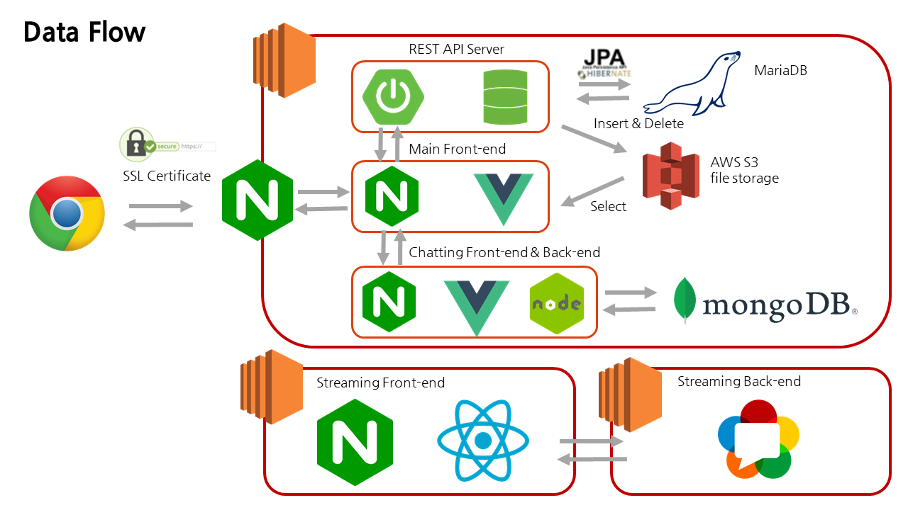

# Welcome to 오늘 셰프

## 오늘 셰프 웹사이트 
🏠 [오늘 셰프](https://k4b204.p.ssafy.io)

 

## :construction_worker: 팀원소개

**:panda_face: Min Seok Cha**

- Github: [@meloncha](https://github.com/meloncha)

**:hatched_chick: Jin Ok Seong**

- Github: [@wlsdhr0831](https://github.com/wlsdhr0831)

**:koala: Sung Ho Park**

- Github: [@solser12](https://github.com/solser12)

**:tiger: Da Yun Kim**

- Github: [@daaaaaayoon](https://github.com/daaaaaayoon)

 

## :+1: 팀명 : 어? 금지
**'프로젝트를 진행하며 어? 라는 당황함을 나타내는 단어로 팀원들을 놀라게 하지 말자'** 하는 의미

## 📆 프로젝트 개요
- **진행 기간**: 2021.04.12 ~ 2021.05.20
- **목표**
    - 요리를 재미있게 하고 싶은 사람
    - 요리를 맛있게 하고 싶은 사람
    - 요리를 편리하게 하고 싶은 사람
    - :star: 이 모든 사람들을 위한 **밀키트 판매 및 밀키트를 활용한 쿠킹 스트리밍 서비스**
- **웹사이트 이름**: 오늘 셰프
    - 밀키트 판매 및 밀키트를 활용한 쿠킹 스트리밍 서비스
- **슬로건** : **"** 오늘만큼은 누구나 맛있는 요리를 하는 셰프가 될 수 있다. 오늘 셰프. **"**

 

## 📒 Tech Log

    
1주차

    <ul>
        <a href="documents/dev_log/20210412_dev_log.md"><li>4/12 - 기획 (방향성 정하기 & 아이디어 회의 및 주제 선정)</li></a>
        <a href="documents/dev_log/20210413_dev_log.md"><li>4/13 - 기획 (주요 기능 상세히 작성하기, 프론트/백 기술 스펙 정하기)</li></a>
        <a href="documents/dev_log/20210414_dev_log.md"><li>4/14 - 기획 (서비스 한 줄 소개 정하기, 프로젝트 계획서 제출, SSAFY 일정 참가)</li></a>
        <a href="documents/dev_log/20210415_dev_log.md"><li>4/15 - 기획 (Design Template 참고, 와이어프레임 작성 관련 discussion) </li></a>
        <a href="documents/dev_log/20210416_dev_log.md"><li>4/16 - BackEnd : DB ERD & Entity 설계, Streaming OpenSource 비교, FrontEnd : jQuery 디자인 Vue로 migration)</li></a>
    </ul>

    
2주차

    <ul>
        <a href="documents/dev_log/20210419_dev_log.md"><li>4/19 - 개발 (FrontEnd: 컴포넌트 큰 틀 잡기, BackEnd: Api 설계) + 기획 변경 사항 (이벤트 목록, 쿠폰 데이터) </li></a>
        <a href="documents/dev_log/20210420_dev_log.md"><li>4/20 - 개발 (FrontEnd: 각자 페이지 작업, BackEnd: Controller 작성 및 엔티티 수정) & 팀 미팅</li></a>
        <a href="documents/dev_log/20210421_dev_log.md"><li>4/21 - 개발 (스트리밍 중간 정리, 서버 배포) & 팀 미팅 (기술 제안 : AR, Unity 등) </li></a>
        <a href="documents/dev_log/20210422_dev_log.md"><li>4/22 - 발표 준비 & 개발 </li></a>
        <a href="documents/dev_log/20210423_dev_log.md"><li>4/23 - 중간 발표 & 개발 & 스트리밍 오픈소스 테스트 및 결정 </li></a>
    </ul>

    
3주차

    <ul>
        <a href="documents/dev_log/20210426_dev_log.md"><li>4/26 - 개발 (FrontEnd: 카카오 로그인, 이미지 제작, OpenVidu 파일 분석, 내 정보 수정, 강의 제작, BackEnd: OpenVidu 소스 분석, CI/CD 구축, 가비아 도메인 적용, mm연동, Swagger3) </li></a>
        <a href="documents/dev_log/20210427_dev_log.md"><li>4/27 - 개발 (FrontEnd: toast UI, image-editor, viewer, CSS, BackEnd: OpenVidu, nginx 설정 변경, 새로운 aws jenkins 적용, mariadb 설치 및 설정) </li></a>
        <a href="documents/dev_log/20210428_dev_log.md"><li>4/28 - 기술 추가 (AR, Unity) & 개발 (API 코드 작성) </li></a>
        <a href="documents/dev_log/20210429_dev_log.md"><li>4/29 - AR 기능 확정 및 테스트 (홍보 영상 출력, 강의별 썸네일 영상 출력, 요리 도구 안내), 스트리밍 테스트 </li></a>
        <a href="documents/dev_log/20210430_dev_log.md"><li>4/30 - 개발 (TODO 기반)</li></a>
    </ul>

    
4주차

    <ul>
        <a href="documents/dev_log/20210503_dev_log.md"><li>5/3 - 팀 미팅 의견 반영 및 서비스 추가 / 개발 </li></a>
        <a href="documents/dev_log/20210504_dev_log.md"><li>5/4 - 개발 (TODO 기반) </li></a>
        <a href="documents/dev_log/20210506_dev_log.md"><li>5/6 - 교보재 결제 & 개인 개발 진행 (주 - API 테스트) </li></a>
        <a href="documents/dev_log/20210507_dev_log.md"><li>5/7 - 개발 (TODO 기반 : 배송 조회 API, 검색 필터, 채팅 기능, 스트리밍 및 STT 구현) </li></a>
    </ul>

    
5주차

    <ul>
        <a href="documents/dev_log/20210510_dev_log.md"><li>5/10 - 일정 변경 및 정리, 팀 미팅 개발 상황 공유, 개발 진행 </li></a>
        <a href="documents/dev_log/20210511_dev_log.md"><li>5/11 - 개발 (TODO 기반) </li></a>
        <a href="documents/dev_log/20210512_dev_log.md"><li>5/12 - 팀 회의 (서비스 명, 로고 수정, AR, UCC 영상 기획), 개발 (TODO 기반)  </li></a>
        <a href="documents/dev_log/20210513_dev_log.md"><li>5/13 - AR 영상 촬영, UCC 콘티 제작 및 촬영, 개발 (TODO 기반)  </li></a>
        <a href="documents/dev_log/20210514_dev_log.md"><li>5/14 - 개발 (TODO 기반)  </li></a>
    </ul>

    
6주차

    <ul>
        <a href="documents/dev_log/20210517_dev_log.md"><li>5/17 - 개발, QA 및 버그 수정 </li></a>
        <a href="documents/dev_log/20210518_dev_log.md"><li>5/18 - DB 초기화, 더미 데이터 삽입, QA 및 버그 수정, css 디자인 수정 </li></a>
        <a href="documents/dev_log/20210520_dev_log.md"><li>5/20 - UCC, PPT, 발표준비, 최종 산출물 제작 및 제출 </li></a>
        <li>5/21 - 포팅 매뉴얼 제출, 발표, README 작성  </li>
    </ul>

## :wrench: 기술 스택

## :rocket: 주요 기능
#### 1. AR 기반의 밀키트 안내서
- **AR 기반 안내서를 위한 안드로이드 앱 제작화면**  
    
- **요리 미리보기 및 영양성분표 확인**  
    
- **동영상을 통한 조리방법 안내**  
    
#### 2. 밀키트를 활용한 언택트 쿠킹 클래스
- **밀키트 정보 확인 및 구매**
    
    + 고객은 사이트에서 밀키트를 검색할 수 있고, 특정 밀키트의 자세한 정보를 제공받습니다.  
    + 해당 제품의 리뷰와 QnA를 통해 구입 여부를 결정할 수 있으며, 원하는 밀키트를 구매하고 배송받을 수 있습니다.  
- **나만의 요리 꿀팁을 공유하는 쿠킹클래스 만들기**
    
    + 모든 고객들은 자신들의 꿀팁을 공유할 수 있는 쿠킹 클래스를 오픈할 수 있습니다.  
- **쿠킹 클래스 참여**
    
    + 요리를 함께 진행하는 과정에서 고객들은 빠른 커뮤니케이션과 정확한 피드백을 받을 수 있습니다.  
- **음성 인식 시스템 제어**
    - 요리를 한다는 특수적인 상황에 있어 편의성을 제공하기 위한 음성 시스템 제어 기능을 제공합니다.
    - 채팅창 켜 / 채팅창 꺼
    
    - 카메라 켜 / 카메라 꺼
    
    - 마이크 켜 / 마이크 꺼
    
- **실시간 음성을 채팅 메세지로 전송**  
    
#### 3. 모두의 쿠킹 커뮤니티
- **커뮤니티 공간 제공**
    
    - 누구나 요리와 관련된 정보를 쉽게 공유할 수 있으며 실시간 접속중인 다른 고객들도 확인이 가능합니다.

## :sparkles: 기대효과
- **건강하고 간편한 집밥 요리 횟수 증가**
- 유저들 간의 다양한 요리 **지식 공유**
- 스트리밍 서비스를 통한 **실시간 질의응답**
- 스트리밍 **음성 제어 서비스**로 요리를 진행하면서도 서비스를 편하게 사용 가능
- 스트리밍 STT기능과 AR 영상 자막 서비스 제공으로 **청각장애인도 편리하게 서비스 이용 가능**
- 향후 카테고리 확장을 통해 **다양한 분야에서 지식 공유 가능**

## :floppy_disk: ERD

## :tv: UCC
[오늘 셰프 UCC](https://youtu.be/K-vmcpYcQWU)
